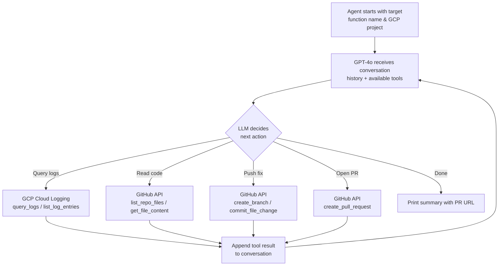

# AI Debugging & Auto-Fix Agent

An autonomous AI agent that investigates production bugs in GCP Cloud Functions by reading real logs and source code, identifies the root cause, generates a fix, and opens a GitHub Pull Request with a detailed investigation report.

## How It Works

The agent uses OpenAI's GPT-4o model in an autonomous **tool-calling loop**. It receives a target Cloud Function name and GCP project, then iteratively decides which tools to call until it has enough information to diagnose the bug and propose a fix.



### Investigation Strategy

1. **Log analysis** -- The agent queries GCP Cloud Logging for HTTP request logs of the target function. It examines request URLs, query parameters, status codes, and response sizes to identify anomalous patterns.
2. **Code inspection** -- It reads the source code from the GitHub repository and traces the logic with suspicious parameter combinations found in the logs (e.g., `limit=0` causing division by zero).
3. **Root cause identification** -- The LLM reasons about what the code produces for those edge-case inputs, even when logs show HTTP 200 (since GCP does not log response bodies).
4. **Fix generation** -- A minimal, targeted code change is committed to a new branch.
5. **Pull Request** -- A PR is opened with a detailed investigation report covering: what was investigated, root cause analysis, impact, the fix, and how to verify.

## Project Structure

```
.
├── agent/
│   ├── __init__.py          # Package marker
│   ├── main.py              # CLI entry point
│   ├── agent.py             # Core LLM agent loop
│   ├── config.py            # Environment variable loading & validation
│   ├── prompts.py           # System prompt and user prompt templates
│   └── tools/
│       ├── __init__.py      # Tool registry (schemas + dispatch)
│       ├── gcp_logging.py   # GCP Cloud Logging tools
│       └── github.py        # GitHub API tools
├── requirements.txt         # Python dependencies
├── .env.example             # Template for required environment variables
└── README.md
```

## Prerequisites

- **Python 3.11+**
- A **GCP project** with a deployed Cloud Function (Gen2 / Cloud Run-backed)
- A **GitHub repository** containing the Cloud Function's source code
- An **OpenAI API key** with access to GPT-4o

## GCP Service Account Setup

The agent authenticates to GCP Cloud Logging using a service account. Follow these steps:

1. **Create a service account** in the [GCP Console](https://console.cloud.google.com/iam-admin/serviceaccounts):
   - Go to IAM & Admin > Service Accounts
   - Click "Create Service Account"
   - Give it a descriptive name (e.g., `debug-agent`)

2. **Assign the IAM role** `roles/logging.viewer` (Logs Viewer):
   - This grants **read-only access to all logs** in the project
   - Go to IAM & Admin > IAM
   - Find your service account and click "Edit"
   - Add the role: **Logs Viewer** (`roles/logging.viewer`)

3. **Generate a JSON key**:
   - Go to the service account's "Keys" tab
   - Click "Add Key" > "Create new key" > JSON
   - A `.json` file will be downloaded

4. **Base64-encode the key** and store it in your `.env` file:
   ```bash
   base64 -i path/to/your-key.json | tr -d '\n'
   ```
   Copy the output and set it as the value of `GCP_SA_KEY_BASE64` in your `.env` file.

> The agent decodes this at runtime into a temporary file, sets `GOOGLE_APPLICATION_CREDENTIALS`, and cleans up on exit. No key files need to be stored on disk.

## Environment Variables

All configuration is handled through a `.env` file. Copy the template and fill in your values:

```bash
cp .env.example .env
```

| Variable | Description |
|---|---|
| `OPENAI_API_KEY` | OpenAI API key (needs access to GPT-4o) |
| `GCP_PROJECT_ID` | Your GCP project ID (e.g., `my-project-123`) |
| `GCP_FUNCTION_NAME` | Name of the deployed Cloud Function to investigate |
| `GCP_SA_KEY_BASE64` | Base64-encoded GCP service account JSON key (see setup above) |
| `GITHUB_TOKEN` | GitHub Personal Access Token with `repo` scope |
| `GITHUB_REPO` | Target repository in `owner/repo` format (e.g., `myuser/my-cloud-function`) |

See [`.env.example`](.env.example) for the template.

## Installation & Usage

### 1. Clone the repository

```bash
git clone https://github.com/itaynachshon/DebugAgent.git
cd DebugAgent
```

### 2. Create a virtual environment and install dependencies

```bash
python3 -m venv .venv
source .venv/bin/activate
pip install -r requirements.txt
```

### 3. Configure environment variables

```bash
cp .env.example .env
# Edit .env and fill in all required values
```

### 4. Run the agent

```bash
python -m agent.main
```

### CLI Options

| Flag | Description | Default |
|---|---|---|
| `--verbose` | Enable verbose output (shows tool arguments and result previews) | Off |
| `--max-iterations N` | Maximum number of LLM tool-calling iterations | 15 |

**Examples:**

```bash
# Run with verbose output
python -m agent.main --verbose

# Run with a higher iteration limit
python -m agent.main --max-iterations 20

# Combine both
python -m agent.main --verbose --max-iterations 25
```

## Tools Reference

The agent has 7 tools available, exposed to the LLM via OpenAI's function calling API:

### GCP Cloud Logging

| Tool | Description |
|---|---|
| `query_logs` | Query Cloud Logging with a custom filter string (supports full [Cloud Logging filter syntax](https://cloud.google.com/logging/docs/view/logging-query-language)) |
| `list_log_entries` | List recent HTTP request logs for a specific Cloud Function (filters by `resource.type`, `service_name`, and `logName`) |

### GitHub

| Tool | Description |
|---|---|
| `list_repo_files` | List files and directories at a given path in the repository |
| `get_file_content` | Read the content of a file from the repository (supports branch/ref selection) |
| `create_branch` | Create a new branch off `main` |
| `commit_file_change` | Update or create a file on a branch with a commit message |
| `create_pull_request` | Open a pull request with a title, description, head branch, and base branch |

## License

This project was built as a home assignment submission.
